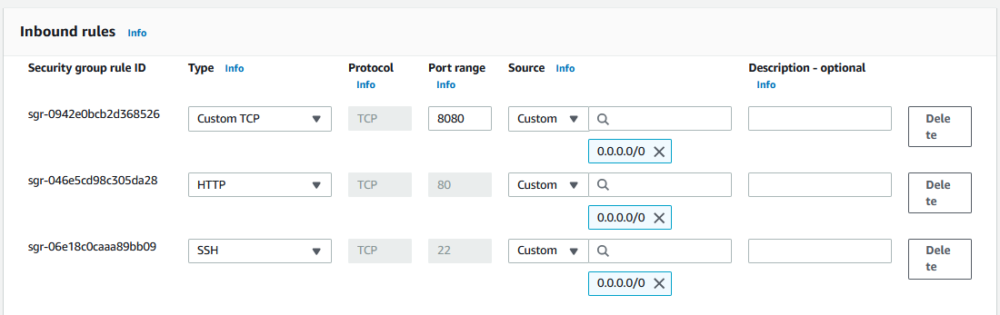
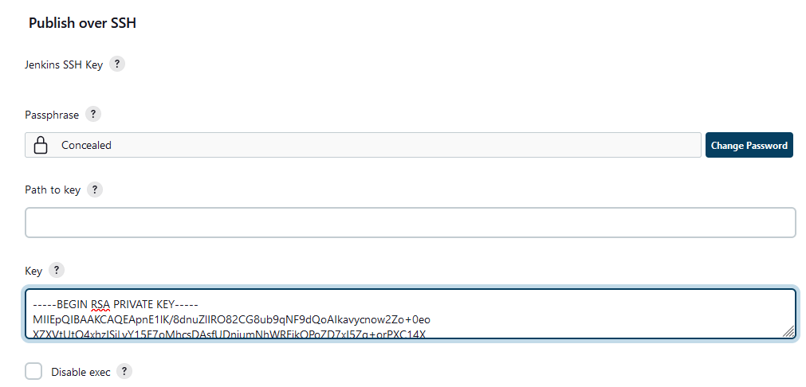

## Project 9 - Tooling Website Deployment Automation With Continuous Integration

## Step 1 - Recreate the Architecture in the diagram from the previous labs

## Step 2 - Install a Jenkins server

> Lauch a new EC2 instance based on Ubuntu Server 20.04 LTS and name it "Jenkins"

  

> Install JDK (since Jenkins is a Java-based application)

    sudo apt update

   

    sudo apt install default-jdk-headless

  

> Install Jenkins
    https://www.jenkins.io/doc/book/installing/linux/#debianubuntu

    curl -fsSL https://pkg.jenkins.io/debian-stable/jenkins.io-2023.key | sudo tee \
    /usr/share/keyrings/jenkins-keyring.asc > /dev/null
---
    echo deb [signed-by=/usr/share/keyrings/jenkins-keyring.asc] \
    https://pkg.jenkins.io/debian-stable binary/ | sudo tee \
    /etc/apt/sources.list.d/jenkins.list > /dev/null
  
---
    sudo apt update
    sudo apt-get install jenkins

  

> Verify jenkins is up and running

    sudo systemctl status jenkins

> Jenkins server uses TCP port 8080 - open it by adding a new inbound rule in your EC2 security group

  

> Perform initial jenkins setup

  http://<Jenkins-Server-Public-IP-Address-or-Public-DNS-Name>:8080

 

> To unlock jenkins, retrieve the password frm the server

    sudo cat /var/lib/jenkins/secrets/initialAdminPassword

c40a80b3a94c419e8cdcc4c5a130c365

> Install Jenkins plugins

> Configure Jenkins to retrieve source code from GitHub using Webhooks

> Go to Jenkins web console, click "New Item" and create a "Freestyle project"

> Connect to your GitHub repository in Jenkins by provding the repostory URL

> Save the configuration and run the build, Click "Build Now" button, if you have configured everything correctly, the build will be successfull and you will see it under #1

> Click "Configure" your job/project and add these two configurations

  - Configure triggering the job from GitHub webhook

  - Post-build Actions

  Click on the drop down arrow and select "Archive the artifact" and then save.

> Now to trigger the build, make changes to repo and commit changes to master branch.

> Artifacts are stored on jenkins server locally 

    ls /var/lib/jenkins/jobs/tooling_github/builds/<build_number>/archive/

> Configure Jenkins to copy files to NFS server via SSH

> Configure the job/project to copy artifacts over to NFS server.

- On main dashboard select "Manage Jenkins" under the "System Configuration menu" choose "System" menu item.

- Scroll down to "Publish over SSH" plugin configuration section and configure it to be able to connect to your NFS server and provide the following details:

- Provide a private key (content of .pem file that you use to connect to NFS server via SSH/Putty)

- Arbitrary name
- Hostname – can be private IP address of your NFS server
- Username – ec2-user (since NFS server is based on EC2 with RHEL 8)
- Remote directory – /mnt/apps since our Web Servers use it as a mointing point to retrieve files from the NFS server

- Test the configuration and make sure the connection returns Success. Remember, that TCP port 22 on NFS server must be open to receive SSH connections.

> Save the configuration, open your Jenkins job/project configuration page and add another one "Post-build Action"

> Configure it to send all files probuced by the build into our previouslys define remote directory. In our case we want to copy all files and directories – so we use **.
If you want to apply some particular pattern to define which files to send – use this syntax.

> Save this configuration and go ahead, change something in README.MD file in your GitHub Tooling repository.

- Webhook will trigger a new job and in the "Console Output" of the job you will find something like this:

> To make sure that the files in /mnt/apps have been udated – connect via SSH/Putty to your NFS server and check README.MD file

    cat /mnt/apps/README.md

